# Apresentação Final do Projeto

# Estrutura de Arquivos e Pastas

Modelo de pastas final:

~~~
├── README.md          <- apresentação do projeto
│
├── data               <- dados usados pelo jogo (se houver)
│
├── src                <- projeto em Java (IntelliJ)
│   │
│   ├── src            <- arquivos-fonte do projeto (.java)
│   │
│   ├── out            <- arquivos em bytecode (.class)
|   |
|   ├── assets         <- mídias usadas no projetos
|   |
│   └── README.md      <- instruções básicas de instalação/execução
│
|── avatar-escape-app  <- Application JAR
|
└── assets             <- arquivos para README
~~~

# Projeto `Avatar-Escape`

# Descrição Resumida do Projeto/Jogo

> O Avatar Aang precisa manter o equílibro, no entanto, a Nação do Fogo possui outros planos.
> Aang precisa passar por alguns de seus inimigos, com a ajuda de seus amigos, até enfrentar o Senhor do Fogo Ozai e, finalmente, acabar com a tirania da Nação do Fogo sobre o mundo.    
> Para jogar, o usuário deve se locomover pelo tabuleiro podendo encontrar sentinelas (escondidos no mapa, que o fazem perder vida) ou seus amigos (visíveis no mapa, que o fazem ganhar vida e "estado avatar" - força).
> Chegando a porta no final do tabuleiro, o usuário deve lutar contra o vilão da fase, com 4 tipos de ações que podem o curar, proteger ou atacar o inimigo. Vencendo essa batalha, o usuário vai para a próxima fase.    
> São 4 fases ao todo sendo que a última é composta apenas por uma batalha contra o Lorde do Fogo Ozai. Caso o usuário morra, o jogo será reiniciado em até três vezes, mantendo o tabuleiro. Em caso do usuário morrer mais de 3 vezes, o jogo é terminado e o tabuleiro mudará.

# Equipe: Homem-Sereia e Mexilhãozinho
* `Beatriz Iamauchi Barroso` - `166531`
* `Pedro Igor Salvador Alves` - `187044`

# Vídeos do Projeto

## Vídeo da Prévia
[Link para o Vídeo da Prévia do Jogo](assets/Video-Previa.mp4)

## Vídeo do Jogo - A FAZER
[Link para o Vídeo de Demonstração do Jogo]()

# Slides do Projeto

## Slides da Prévia
[Link para os Slides da Prévia do Jogo](assets/Slides-Previa.pdf)

## Slides da Apresentação Final - A FAZER
[Link para os Slides da Apresentação Final do Jogo]()

## Relatório de Evolução
> Nossa ideia inicial era realizar um jogo tipo "campo minado" com algumas estratégias a mais.
> Para isso, realizamos primeiro um protótipo visual do jogo, e começamos a lapidar a nossa ideia.
> 
> Logo na Entrega Parcial, fomos apresentados ao fato do nosso jogo, nas etapas da batalha, ser mais expositivo do que participativo.
> Visando corrigir esse problema, remodelamos essa etapa para que os usuários pudessem escolher "cartas" para utilizar nas batalhas, iniciando aqui a segunda etapa do nosso projeto.
> Na primeira etapa do projeto (até a entrega parcial), nós tinhamos bem pouco do projeto programado, por isso, quando começamos a nova etapa, acabaram havendo várias alterações no nosso código, sua arquitetura e lógica.
> 
> Nessa segunda etapa do projeto, algumas ideias surgiram, como, por exemplo, o usuário ter 3 vidas antes do tabuleiro mudar (algo que não priorizamos fazer por conta do tempo) e a imagem, de onde estavam os sentinelas, ficar na tela por alguns segundos antes de desaparecer. 
> Com essas novas ideias já acertadas, iniciamos a parte de programação.
> Alteramos a nossa arquitetura, ao ver que comunicação de certos componentes não havia como ser feita da maneira que havíamos pensado o código anteriormente.
> Assim, melhoramos a nossas interfaces para que a classe GameController tivesse mais contato com a classe Characters, mudança necessária para a geração facilitada dos gráficos do jogo, que falaremos posteriormente.
> 
> Começamos a programar as classes separadas, deixando a GraphController por último, visto que não conhecíamos muito sobre ferramentas de interfáce gráfica em java, e por isso, ainda tinhamos que pesquisar sobre, para em seguida montar essa classe.
> Após finalizarmos a programação das demais classes, passamos para a construção da Interfáce Gráfica.
> Fomos apresentados por um amigo do curso a ferramenta JavaFX, a qual permitia a criação dos gráficos de uma forma mais intuitiva e simples.
> 
> Estudamos sobre o uso do JavaFX, e então partimos para a construção dos gráficos. Vimos logo de começo que não poderíamos manter a estrutura pensada anteriormente (da construção dos gráficos ser feita em uma mesma classe).
> Por isso, além da classe GraphController, criamos classes para cada tipo de tabuleiro, com uma classe para a manutenção das ações do usuário (controllers) e os seus graficos (designers, que posicionavam e estilizavam os elementos na tela).
> Assim, dividimos em InitialScreen (tela de instruções do jogo), BoardScreen (tela do tabuleiro de campo minado), FightScreen (tela de batalha contra vilões) e PlayAgainScreen (tela de vitória ou derrota).
> Ademais, também vimos que algumas das nossas ideias do design do jogo não conseguiriam ser desenvolvidas com o tempo e a ferramenta que tínhamos, o que levou a leves alterações em nosso design.
> 
> Por fim, terminamos o nosso projeto, e finalizamos a documentação do README.

# Destaques de Código
Aqui temos a classe Builder que faz a criação do tabuleiro baseado em um mapa que é enviado como argumento.
~~~java
public class Builder implements iBuilderProperties{
    private iBoardProperties board;
    
    <...>

    private void buildLevel(String CSVsource){ //constrói o tabuleiro
        CSVUser positions = new CSVUser();
        positions.setDataSource(CSVsource);
        String commands[][] = positions.requestCommands(); //retorno = [[1:1, P], [1:2, _], ...,[4:4, _]];
        for (int i = 0; i < boardHeight*boardWidth; i++) {
            if (commands[i][1].equals("A")) {
                iCharacterProperties aang = new Aang("Aang", "/assets/characters/heroes/Aang.png", i / 6, i % 6, 100, 25);
                board.setCellBoard(aang, i / 6, i % 6);
            } else if (commands[i][1].equals("K")) {
                iCharacterProperties kataraSokka = new Heroes("Katara", "/assets/characters/heroes/SokkaKatara.png", i / 6, i % 6, 0, 20);
                board.setCellBoard(kataraSokka, i / 6, i % 6);
            } else if (commands[i][1].equals("T")) {
                iCharacterProperties toph = new Heroes("Toph", "/assets/characters/heroes/Toph.png", i / 6, i % 6, 10, 10);
                board.setCellBoard(toph, i / 6, i % 6);
            } else if (commands[i][1].equals("Z")) {
                iCharacterProperties zuko = new Heroes("Zuko", "/assets/characters/heroes/Zuko.png", i / 6, i % 6, 10, 15);
                board.setCellBoard(zuko, i / 6, i % 6);
            } else if (commands[i][1].equals("F")) {
                iCharacterProperties sentinela = new Villains("FireVillain", "/assets/characters/villains/sentinela.png", i / 6, i % 6, 0, -5);
                board.setCellBoard(sentinela, i / 6, i % 6);
            } else if (commands[i][1].equals("AP")) {
                iCharacterProperties appa = new Heroes("Appa", "/assets/characters/heroes/Appa.png", i / 6, i % 6, 0, 0);
                board.setCellBoard(appa, i / 6, i % 6);
            } else if (commands[i][1].equals("-")) {
                board.setCellBoard(null, i / 6, i % 6);
            } else if (commands[i][1].equals("P")) {
                iCharacterProperties door = new Heroes("Door", "/assets/characters/heroes/Door.png", i / 6, i % 6, 0, 0);
                board.setCellBoard(door, i / 6, i % 6);
            }
        }
    }
}
~~~

A seleção de qual mapa usar é feita randomicamente, mas baseada em mapas já construídos em arquivos CSV
~~~java
public class BoardScreenController extends GameController {
    <...>

    public Scene boardScreen(){
        screen.getStage().setTitle("Avatar Escape - Fase " + screen.getGame().getBoard().getBoard().getLevel());
        String map = "src/assets/maps/level" + screen.getGame().getBoard().getBoard().getLevel() + "/fase" + screen.getGame().getBoard().getBoard().getLevel() + "." + String.valueOf(new Random().nextInt(15) + 1) + ".csv";
        this.screen.getGame().play(map);

        <...>
    }

    <...>
}
~~~

# Destaques de Pattern (Singleton)
#### Objetivo: 
A ideia de utilizar um Creation Pattern (Singleton) é ter certeza de que uma classe terá uma única instância, provendo acesso global a essa instância.

#### Aplicabilidade:
Para salvar o estado do player (Aang) durante as mudanças de fases e no próprio controle de criação do tabuleiro, fazemos com que o GameController (assim como acontece com o Stage do JavaFX em que é instanciado uma única vez) seja instanciado apenas uma vez. Caso seja preciso resetar o jogo, temos uma função para isso.

## Diagrama do Pattern
A classe GraphController declara o método getGame que retorna a instânc ia estática 
do iGameControllerProperties, fazendo com que haja uma autorreferência da classe. 

## Código do Pattern
No código apresentarmos parte da classe GraphController em que focamos no instanciamento do jogo e da tela apenas uma vez. Vide os trechos abaixo em que, ao invés de criarem novas instâncias, apenas acessam globalmente as únicas já criadas.
~~~java
public class GraphController extends Application implements iGraphControllerProperties {
    private static iGameControllerProperties game = new GameController();
    private static iGraphControllerProperties screen = new GraphController();
    
    <...>

    public iGameControllerProperties getGame(){
        return this.game;
    }
}
~~~
~~~java
public class InitialScreenController {
    private iGraphControllerProperties screen;

    public InitialScreenController(iGraphControllerProperties screen) {
        this.screen = screen;
    }
    
    <...>
}
~~~
~~~java
public class BoardScreenController extends GameController {
    <...>
    private iGraphControllerProperties screen;

    public BoardScreenController(iGraphControllerProperties screen) {
        this.screen = screen;
    }
    
    <...>
}
~~~

# Conclusões e Trabalhos Futuros
> Cabe dizer aqui que ficamos muito contentes com o resultado final do trabalho,
> pois colocamos em prática um semestre inteiro de aprendizado em POO. Além disso, também
> aprendemos uma a manipular um novo tipo de ferramenta, isto é, o JavaFX.   
> Ao longo do projeto, verificamos que algumas ideias levariam certo tempo e maturidade para serem
> aplicadas. No entanto, ficam como um anseio da dupla de, no futuro, programá-los:
> 1. ####Efeitos Sonoros:
>   * Pensar na experiência do usuário é importante para qualquer tipo de aplicação, sendo o uso
>   de sons em jogos um componente de tal experiência, já que poderia indicar movimentos corretos e incorretos, por exemplo.
> 2. ####Vidas:
>   * Como citado anteriormente, para que o jogo não precisasse ser reiniciado toda vez que o usuário chegasse a vida 0%,
>   gostariamos de que houvessem 3 chances, assim, o usuário iria jogar no mesmo mapa durante essas 3 chances.
> 3. ####Animações e mídias mais sofisticadas:
>   * Para melhor o aspecto visual do jogo, também queremos implementar animações mais elegantes
>   e em 3D.
> 4. ####Mapas Randomicos:
>   * Por fim, seria muito interessante pensar numa aplicação que cria mapas aleatoriamente
>   sem precisar criar vários previamente.

# Documentação dos Componentes

# Diagramas

## Diagrama Geral do Projeto

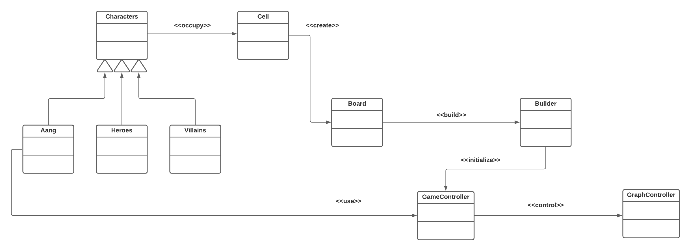

## Diagrama Geral de Componentes

Este é o diagrama compondo componentes para análise:

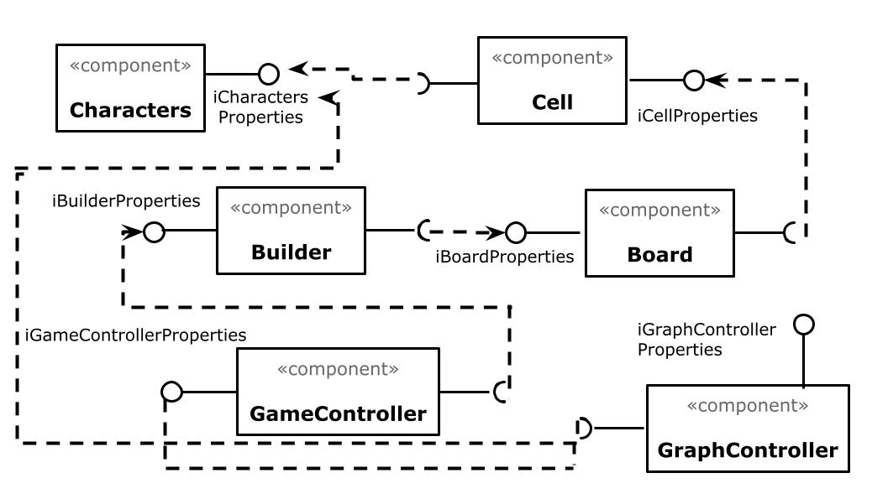

## Componente `Character`

> Demonimamos como componente character uma classe e uma interface descrita a seguir. Este componente é responsável por agregar as informações de cada personagem do jogo, como nome, dano, etc.

**Ficha Técnica**

item | Detalhamento
----- | -----
Classe | `src.CharacterComponent`
Autores | `Beatriz Iamauchi Barroso`   `Pedro Igor Salvador Alves`
Interfaces | `iCharacterProperties`

### Interfaces

Interfaces associadas a esse componente:

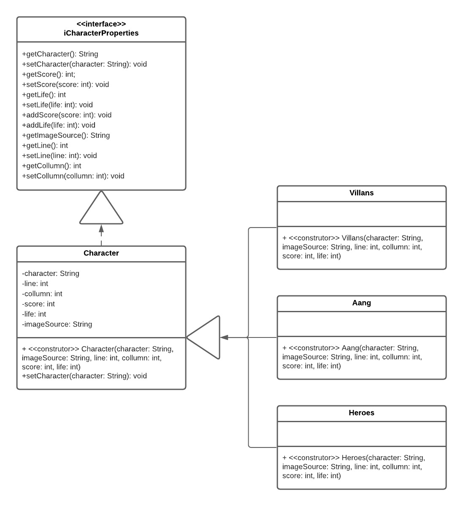

Interface agregadora do componente em Java:

~~~java
public interface iCharacterProperties {
    String getCharacter();
    void setCharacter(String character);
    String getImageSource();
    int getLine();
    void setLine(int line);
    int getCollumn();
    void setCollumn(int collumn);
    int getScore();
    void setScore(int score);
    int getLife();
    void setLife(int life);
    void addScore(int score);
    void addLife(int life);
}
~~~

## Componente `Cell`

> Demonimamos como componente cell uma classe e uma interface descrita a seguir. Este componente é responsável por agregar um personagem do jogo e seus atributos.

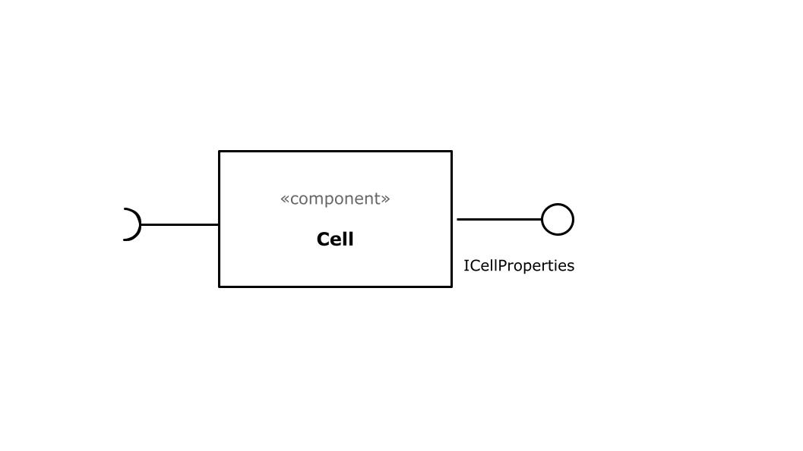

**Ficha Técnica**

item | Detalhamento
----- | -----
Classe | `src.CellComponent`
Autores | `Beatriz Iamauchi Barroso`   `Pedro Igor Salvador Alves`
Interfaces | `iCellProperties`

### Interfaces

Interfaces associadas a esse componente:

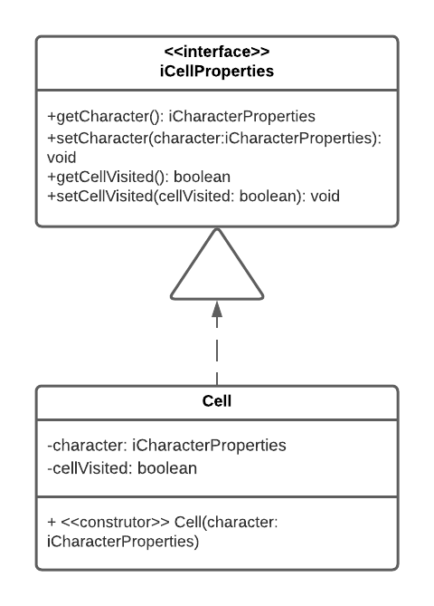

Interface agregadora do componente em Java:

~~~java
public interface iCellProperties {
    iCharacterProperties getCharacter();
    void setCharacter(iCharacterProperties character);
    boolean getCellVisited();
    void setCellVisited(boolean cellVisited);
}
~~~

## Componente `Board`

> Demonimamos como componente Board um conjunto de classes e interfaces descritas a seguir. Este componente é responsável por agregar as células de um tabuleiro e seus atributos ou a criação da luta com o vilão da fase.

**Ficha Técnica**

item | Detalhamento
----- | -----
Classe | `src.BoardComponent`
Autores | `Beatriz Iamauchi Barroso`   `Pedro Igor Salvador Alves`
Interfaces | `iBoardProperties`

### Interfaces

Interfaces associadas a esse componente:

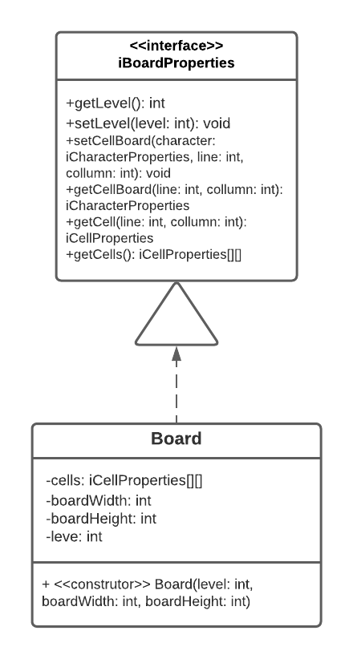

Interface agregadora do componente em Java:

~~~java
public interface iBoardProperties {
    int getLevel();
    void setLevel(int level);
    void setCellBoard(iCharacterProperties character, int line, int collumn);
    iCharacterProperties getCellBoard(int line, int collumn);
    iCellProperties getCell(int line, int collumn);
    iCellProperties[][] getBoard();
}
~~~

## Componente `Builder`

> Responsável pela criação do tabuleiro da fase ou da luta com o vilão da fase.

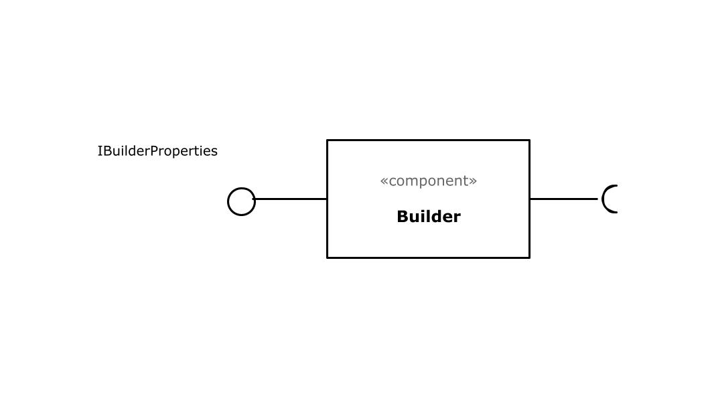

**Ficha Técnica**

item | Detalhamento
----- | -----
Classe | `src.BuilderComponent`
Autores | `Beatriz Iamauchi Barroso`   `Pedro Igor Salvador Alves`
Interfaces | `iBuilderProperties`

### Interfaces

Interfaces associadas a esse componente:

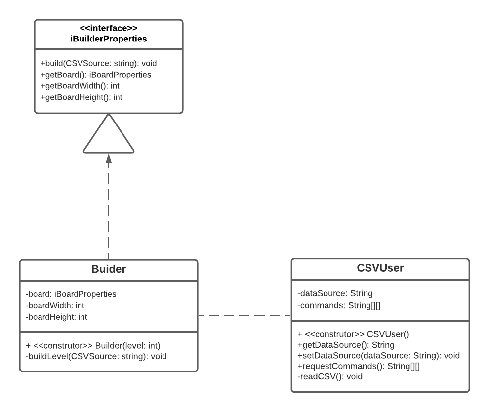

Interface agregadora do componente em Java:

~~~java
public interface iBuilderProperties {
    void setCellsNeeded(boolean cellsNeeded);
    boolean getCellsNeeded();
    void getBoardWidth(int boardWidth);
    void getBoardHeight(int boardHeight);
}
~~~

## Componente `GameController`

> Demonimamos como componente gameController uma classe e uma interface descrita a seguir. Este componente é responsável pelo controle geral do jogo.

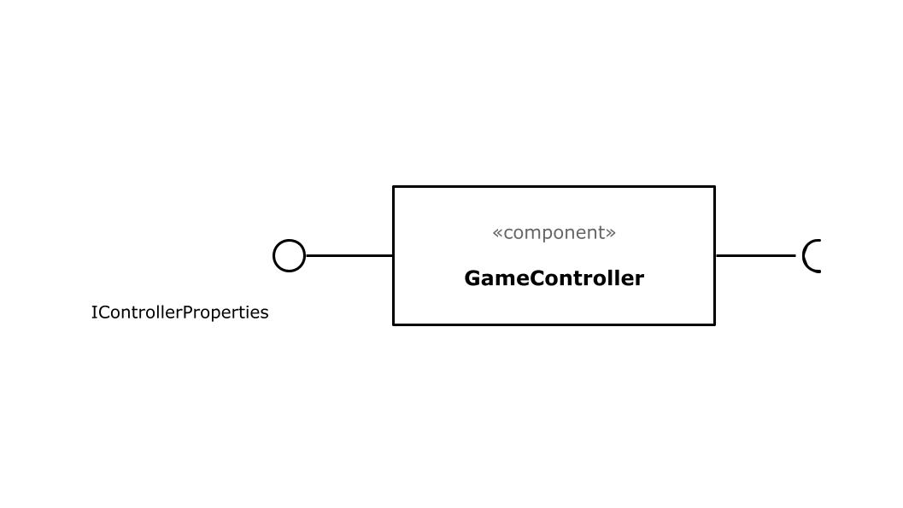

**Ficha Técnica**

item | Detalhamento
----- | -----
Classe | `src.GameControllerComponent`
Autores | `Beatriz Iamauchi Barroso`   `Pedro Igor Salvador Alves`
Interfaces | `iGameControllerProperties`

### Interfaces

Interfaces associadas a esse componente:

Interface agregadora do componente em Java:

~~~java
public interface iGameControllerProperties {
    void play(String CSV);
    iBuilderProperties getBoard();
    iCharacterProperties getAvatar();
    void resetGame();
}
~~~

## Componente `GraphControllerComponent`

> Demonimamos como componente graphController uma classe e uma interface descrita a seguir. Este componente é responsável pelo controle geral do gráfico do jogo, separando o gráficos por: BoardScreen (tabuleiro), FightScreen (tela de batalha com vilão), InitialScreen (tela inicial de instruções do jogo), e PlayAgainScreen (tela de vitória ou derrota do jogo).

**Ficha Técnica**

item | Detalhamento
----- | -----
Classe | `src.GraphControllerComponent`
Autores | `Beatriz Iamauchi Barroso`   `Pedro Igor Salvador Alves`
Interfaces | `iGraphControllerProperties`

### Interfaces

Interfaces associadas a esse componente:

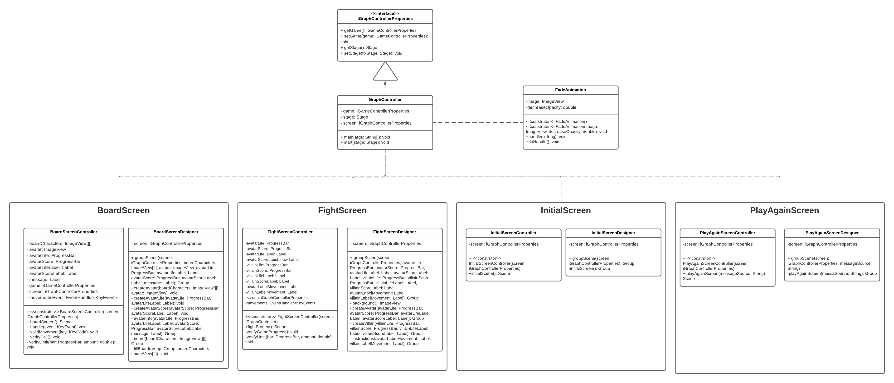

Interface agregadora do componente em Java:

~~~java
public interface iGraphControllerProperties {
    iGameControllerProperties getGame();
    void setGame(iGameControllerProperties game);
    Stage getStage();
    void setStage(Stage fixStage);
}
~~~

## Detalhamento das Interfaces

### Interface `iCharacterproperties`

Informa e altera os atributos de um personagem.

Método | Objetivo
-------| --------
`getCharacter` | Retorna o nome personagem que está na célula.
`setCharacter` | Altera o nome personagem que está na célula.
`getImageSource` | Retorna o caminho até a imagem do personagem.
`getLine` | Retorna a linha que o personagem se encontra.
`setLine` | Altera a linha que o personagem se encontra.
`getCollumn` | Retorna a coluna que o personagem se encontra.
`setCollumn` | Altera a coluna que o personagem se encontra.
`getScore` | Retorna o quanto o personagem altera o Estado Avatar do Aang.
`setScore` | Altera o quanto o personagem altera o Estado Avatar do Aang.
`getLife` | Retorna o quanto o personagem altera a Vida do Aang.
`setLife` | Altera o quanto o personagem altera a Vida do Aang.
`addScore` | Altera o indicador de Estado Avatar do Aang.
`addLife` | Altera o indicador de Vida do Aang.

### Interface `iCellproperties`

Define e altera o personagem da célula, assim como informa se a célula ja foi visitada ou não.

Método | Objetivo
-------| --------
`getCharacter` | Retorna o personagem que está na célula.
`setCharacter` | Altera o personagem que está na célula.
`getCellVisited` | Informa se a célula já foi visitada ou não.
`setCellVisited` | Altera a informação de se a célula já foi visitada ou não.

### Interface `iBoardProperties`

Interface que provê algumas das funções do tabuleiro

Método | Objetivo
-------| --------
`getLevel` | Retorna o nível do tabuleiro
`setLevel` | Atribui um novo nível ao tabuleiro
`setCellBoard` | Atribui à célula do tabuleiro um personagem
`getCellBoard` | Retorna o personagem da célula em determina posição do tabuleiro
`getCell` | Retorna determinada célula do tabuleiro
`getBoard` | Retorna o tabuleiro

### Interface `iBuilderPropeties`

Interface que provê algumas das funções do tabuleiro

Método | Objetivo
-------| --------
`setCellsNeeded` | Atribui se é preciso células (pois caso sim, trata-se de um tabuleiro)
`getCellsNeeded` | Retorna se é preciso de células para a construção daquela fase
`getBoardWidth` | Retorna a largura do tabuleiro
`getBoardHeight` | Retorna a altura do tabuleiro

### Interface `iGameControllerPropeties`

Interface que atualiza as informações gerais do Jogo para a construção da interface gráfica.

Método | Objetivo
-------| --------
`play` | Chama a função do Builder para construir o jogo.
`getBoard` | Retorna o tabuleiro.
`getAvatar` | Retorna as informações atreladas ao Avatar em iCharacterProperties.
`resetGame` | Reinicia o jogo.

### Interface `iGraphControllerPropeties`

Interface que atualiza a interface gráfica

Método | Objetivo
-------| --------
`getGame` | Retorna o tabuleiro da fase.
`setGame` | Altera o tabuleiro da fase.
`getStage` | Retorna a fase.
`setStage` | Altera  a fase.

# Plano de Exceções

## Diagrama da hierarquia de exceções

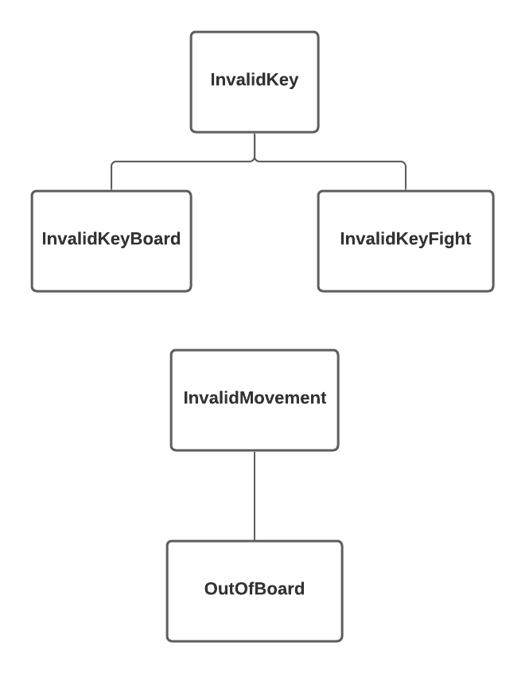

## Descrição das classes de exceção

Classe | Descrição
----- | -----
InvalidKey | Engloba todas as exceções de ações feitas com teclas inválidas.
InvalidKeyBoard | Indica a ação feita com uma tecla inválida é inútil na fase de tabuleiro.
InvalidKeyFight | Indica a ação feita com uma tecla inválida é inútil na fase de batalha com vilão.
InvalidMovement | Engloba as exceções de movimentos não aceitos no tabuleiro.
OutOfBoard | Indica que o movimento para fora do tabuleiro é inútil.