# Apresentação Final do Projeto

# Estrutura de Arquivos e Pastas

Modelo de pastas final: (ainda em construção)

~~~
├── README.md          <- apresentação do projeto
│
├── data               <- dados usados pelo jogo (se houver)
│
├── src                <- projeto em Java (IntelliJ)
│   │
│   ├── src            <- arquivos-fonte do projeto (.java)
│   │
│   ├── out            <- arquivos em bytecode (.class)
│   │
│   └── README.md      <- instruções básicas de instalação/execução
│
└── assets             <- mídias usadas no projeto
~~~

## `data`

Aqui ficarão os arquivos de dados usados no projeto. Como, por exemplo, os arquivos .txt que serão usados para a criação de mapas.

## `src`

Projeto em Java, utilizamos a IDE IntelliJ, incluindo todos os arquivos de dados e bibliotecas necessários para a sua execução.

## `assets`

Aqui ficarão as mídias do projeto: vídeo, imagens, animações, slides etc.

# Projeto `Avatar-Escape`

# Descrição Resumida do Projeto/Jogo

> O Avatar Aang precisa manter o equílibro, no entanto, a Nação do Fogo possui outros planos.
> Aang precisa passar por alguns de seus inimigos, com a ajuda de seus amigos, até enfrentar o Senhor do Fogo Ozai e, finalmente, acabar com a tirania da Nação do Fogo sobre o mundo.    
> Para jogar, o usuário deve se locomover pelo tabuleiro podendo encontrar sentinelas (escondidos no mapa, que o fazem perder vida) ou seus amigos (visíveis no mapa, que o fazem ganhar vida e "estado avatar" - força).
> Chegando a porta no final do tabuleiro, o usuário deve lutar contra o vilão da fase, com 4 tipos de ações que podem o curar, proteger ou atacar o inimigo. Vencendo essa batalha, o usuário vai para a próxima fase.    
> São 4 fases ao todo sendo que a última é composta apenas por uma batalha contra o Lorde do Fogo Ozai. Caso o usuário morra, o jogo será reiniciado em até três vezes, mantendo o tabuleiro. Em caso do usuário morrer mais de 3 vezes, o jogo é terminado e o tabuleiro mudará.

# Equipe: Homem-Sereia e Mexilhãozinho
* `Beatriz Iamauchi Barroso` - `166531`
* `Pedro Igor Salvador Alves` - `187044`

# Vídeos do Projeto

## Vídeo da Prévia
[Link para o Vídeo da Prévia do Jogo](./arquivos-apresentacao/Video-Previa.mp4)

## Vídeo do Jogo
[Link para o Vídeo de Demonstração do Jogo]()

# Slides do Projeto

## Slides da Prévia
[Link para os Slides da Prévia do Jogo](./arquivos-apresentacao/Slides-Previa.pdf)

## Slides da Apresentação Final
[Link para os Slides da Apresentação Final do Jogo]()

## Relatório de Evolução
> Texto Texto Texto

# Destaques de Código
`Texto Texto Texto`

# Destaques de Pattern

## Diagrama do Pattern
`Texto Texto Texto`

## Código do Pattern
`Texto Texto Texto`

# Conclusões e Trabalhos Futuros
> Apresente aqui as conclusões do projeto e propostas de trabalho futuro. Esta é a oportunidade em que você pode indicar melhorias no projeto a partir de lições aprendidas e conhecimentos adquiridos durante a realização do projeto, mas que não puderam ser implementadas por questões de tempo. Por exemplo, há design patterns aprendidos no final do curso que provavelmente não puderam ser implementados no jogo -- este é o espaço onde você pode apresentar como aplicaria o pattern no futuro para melhorar o jogo.

# Documentação dos Componentes
O vídeo a seguir apresenta um detalhamento de um projeto baseado em componentes:
`COLOCAR UM VÍDEO?`

# Diagramas

## Diagrama Geral do Projeto

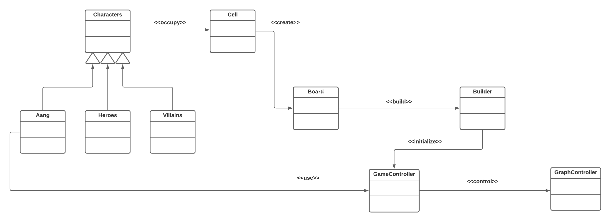

## Diagrama Geral de Componentes

Este é o diagrama compondo componentes para análise:

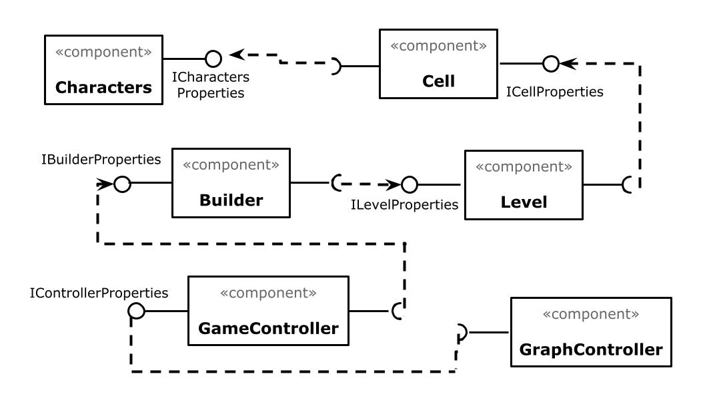

## Componente `Character`

> Demonimamos como componente character uma classe e uma interface descrita a seguir. Este componente é responsável por agregar as informações de cada personagem do jogo, como nome, dano, etc.

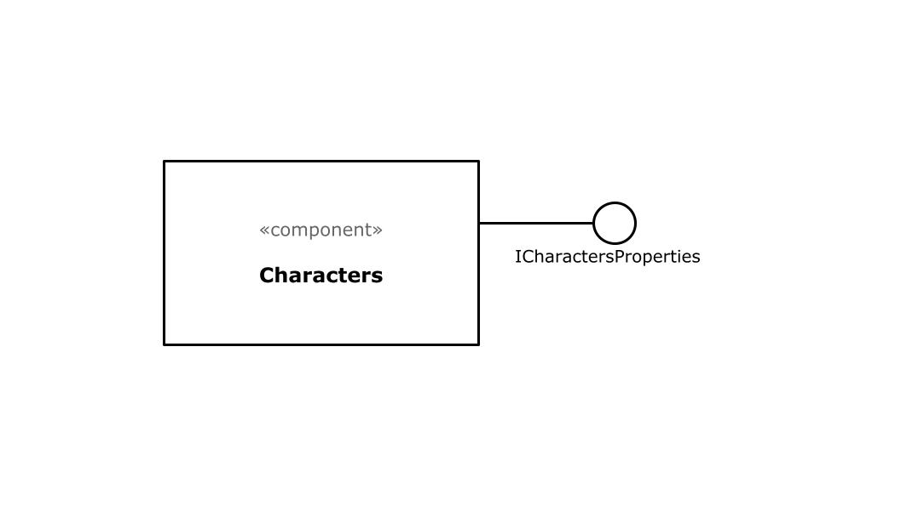

**Ficha Técnica**

item | Detalhamento
----- | -----
Classe | `src.CharacterComponent`
Autores | `Beatriz Iamauchi Barroso`   `Pedro Igor Salvador Alves`
Interfaces | `iCharacterProperties`

### Interfaces

Interfaces associadas a esse componente:

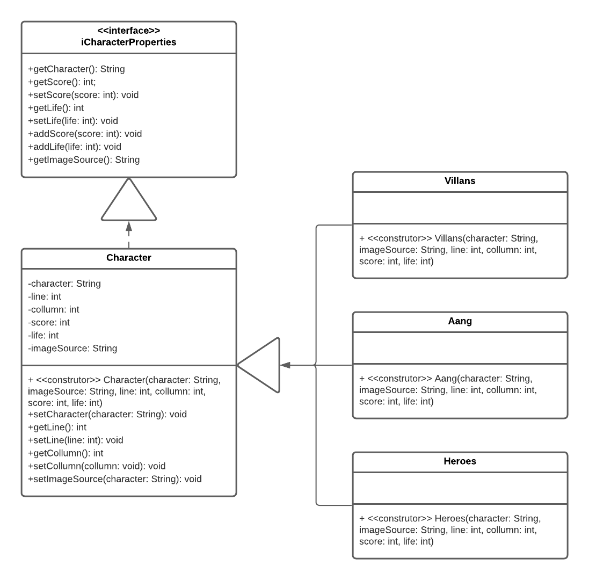

Interface agregadora do componente em Java:

~~~java
public interface iCharacterProperties {
    String getCharacter();
    void setCharacter(String character);
    String getImageSource();
    int getLine();
    void setLine(int line);
    int getCollumn();
    void setCollumn(int collumn);
    int getScore();
    void setScore(int score);
    int getLife();
    void setLife(int life);
    void addScore(int score);
    void addLife(int life);
}
~~~

## Componente `Cell`

> Demonimamos como componente cell uma classe e uma interface descrita a seguir. Este componente é responsável por agregar um personagem do jogo e seus atributos.

**Ficha Técnica**

item | Detalhamento
----- | -----
Classe | `src.CellComponent`
Autores | `Beatriz Iamauchi Barroso`   `Pedro Igor Salvador Alves`
Interfaces | `iCellProperties`

### Interfaces

Interfaces associadas a esse componente:

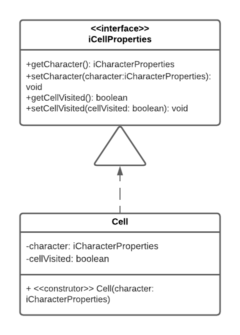

Interface agregadora do componente em Java:

~~~java
public interface iCellProperties {
    iCharacterProperties getCharacter();
    void setCharacter(iCharacterProperties character);
    boolean getCellVisited();
    void setCellVisited(boolean cellVisited);
}
~~~

## Componente `Board`

> Demonimamos como componente Board um conjunto de classes e interfaces descritas a seguir. Este componente é responsável por agregar as células de um tabuleiro e seus atributos ou a criação da luta com o vilão da fase.

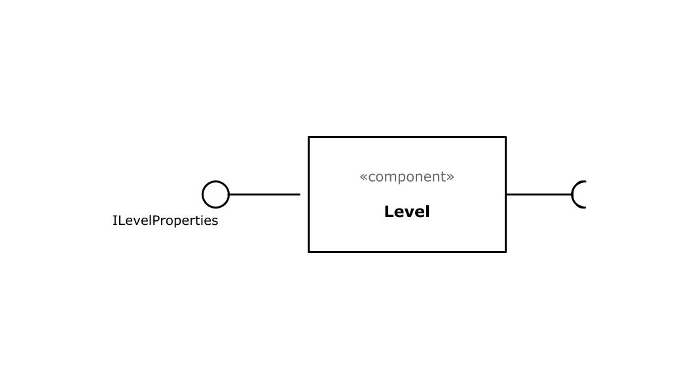

**Ficha Técnica**

item | Detalhamento
----- | -----
Classe | `src.BoardComponent`
Autores | `Beatriz Iamauchi Barroso`   `Pedro Igor Salvador Alves`
Interfaces | `iBoardProperties`   `iFightProperties`

### Interfaces

Interfaces associadas a esse componente:

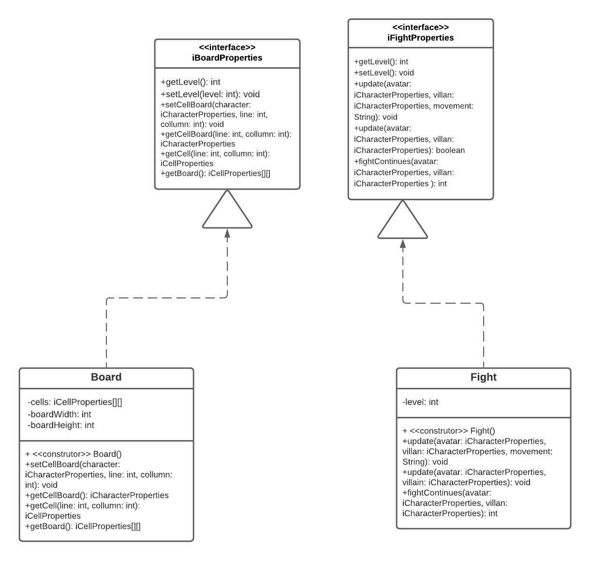

Interface agregadora do componente em Java:

~~~java
public interface iBoardProperties {
    int getLevel();
    void setLevel(int level);
    void setCellBoard(iCharacterProperties character, int line, int collumn);
    iCharacterProperties getCellBoard(int line, int collumn);
    iCellProperties getCell(int line, int collumn);
    iCellProperties[][] getBoard();
}
~~~

## Componente `Builder`

> Responsável pela criação do tabuleiro da fase ou da luta com o vilão da fase.

**Ficha Técnica**

item | Detalhamento
----- | -----
Classe | `src.BuilderComponent`
Autores | `Beatriz Iamauchi Barroso`   `Pedro Igor Salvador Alves`
Interfaces | `iBuilderProperties`

### Interfaces

Interfaces associadas a esse componente:

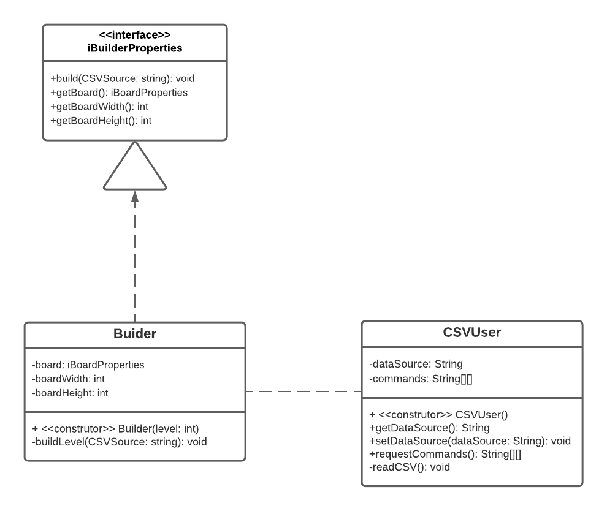

Interface agregadora do componente em Java:

~~~java
public interface iBuilderProperties {
    void setCellsNeeded(boolean cellsNeeded);
    boolean getCellsNeeded();
    void getBoardWidth(int boardWidth);
    void getBoardHeight(int boardHeight);
}
~~~

## Componente `GameController`

> Demonimamos como componente gameController uma classe e uma interface descrita a seguir. Este componente é responsável pelo controle geral do jogo.

**Ficha Técnica**

item | Detalhamento
----- | -----
Classe | `src.GameControllerComponent`
Autores | `Beatriz Iamauchi Barroso`   `Pedro Igor Salvador Alves`
Interfaces | `iControllerProperties`

### Interfaces

Interfaces associadas a esse componente:

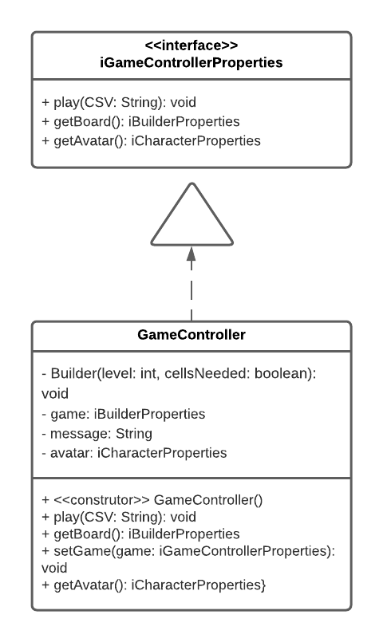

Interface agregadora do componente em Java:

~~~java
public interface iGameControllerProperties {
    void play(String CSV);
    iBuilderProperties getBoard();
    iCharacterProperties getAvatar();
    void resetGame();
}
~~~

## Componente `GraphControllerComponent`

> Demonimamos como componente graphController uma classe e uma interface descrita a seguir. Este componente é responsável pelo controle geral do gráfico do jogo, separando o gráficos por: BoardScreen (tabuleiro), FightScreen (tela de batalha com vilão), InitialScreen (tela inicial de instruções do jogo), e PlayAgainScreen (tela de vitória ou derrota do jogo).

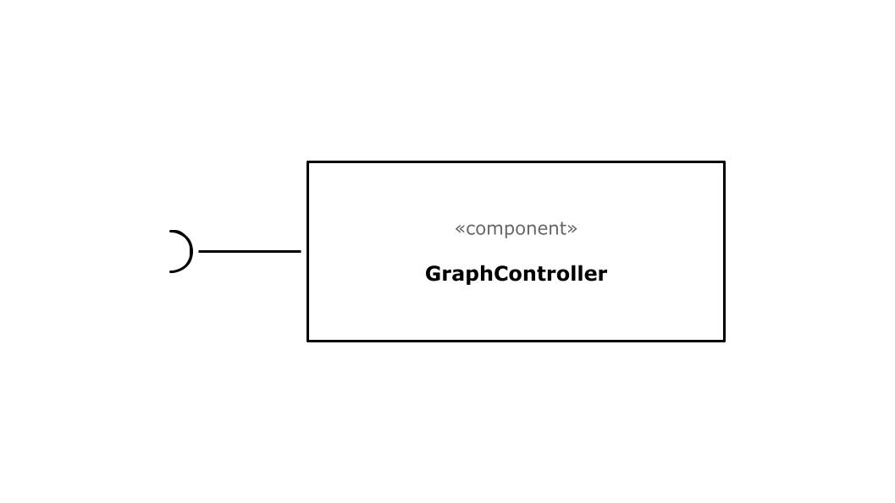

**Ficha Técnica**

item | Detalhamento
----- | -----
Classe | `src.GraphControllerComponent`
Autores | `Beatriz Iamauchi Barroso`   `Pedro Igor Salvador Alves`
Interfaces |

### Interfaces

Interfaces associadas a esse componente:

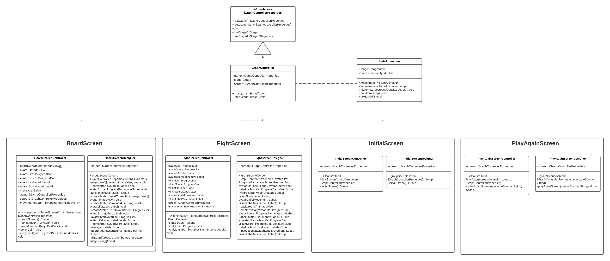

Interface agregadora do componente em Java:

~~~java
public interface iGraphControllerProperties {
    iGameControllerProperties getGame();
    void setGame(iGameControllerProperties game);
    Stage getStage();
    void setStage(Stage fixStage);
}
~~~

## Detalhamento das Interfaces

### Interface `iCharacterproperties`

Informa e altera os atributos de um personagem.

Método | Objetivo
-------| --------
`getCharacter` | Retorna o nome personagem que está na célula.
`setCharacter` | Altera o nome personagem que está na célula.
`getImageSource` | Retorna o caminho até a imagem do personagem.
`getLine` | Retorna a linha que o personagem se encontra.
`setLine` | Altera a linha que o personagem se encontra.
`getCollumn` | Retorna a coluna que o personagem se encontra.
`setCollumn` | Altera a coluna que o personagem se encontra.
`getScore` | Retorna o quanto o personagem altera o Estado Avatar do Aang.
`setScore` | Altera o quanto o personagem altera o Estado Avatar do Aang.
`getLife` | Retorna o quanto o personagem altera a Vida do Aang.
`setLife` | Altera o quanto o personagem altera a Vida do Aang.
`addScore` | Altera o indicador de Estado Avatar do Aang.
`addLife` | Altera o indicador de Vida do Aang.

### Interface `iCellproperties`

Define e altera o personagem da célula, assim como informa se a célula ja foi visitada ou não.

Método | Objetivo
-------| --------
`getCharacter` | Retorna o personagem que está na célula.
`setCharacter` | Altera o personagem que está na célula.
`getCellVisited` | Informa se a célula já foi visitada ou não.
`setCellVisited` | Altera a informação de se a célula já foi visitada ou não.

### Interface `iBoardProperties`

Interface que provê algumas das funções do tabuleiro

Método | Objetivo
-------| --------
`getLevel` | Retorna o nível do tabuleiro
`setLevel` | Atribui um novo nível ao tabuleiro
`setCellBoard` | Atribui à célula do tabuleiro um personagem
`getCellBoard` | Retorna o personagem da célula em determina posição do tabuleiro
`getCell` | Retorna determinada célula do tabuleiro
`getBoard` | Retorna o tabuleiro

### Interface `iFightProperties - O QUE É ELA?`

Interface que provê algumas das funções da luta

~~~java
public interface iFightProperties {
    int getLevel();
    void setLevel(int level);
    void update(iCharacterProperties avatar, iCharacterProperties villan, String movement);
    boolean update(iCharacterProperties avatar, iCharacterProperties villan);
    int fightContinues(iCharacterProperties avatar, iCharacterProperties villan);
}
~~~

Método | Objetivo
-------| --------
`getLevel` | Retorna o nível do tabuleiro
`setLevel` | Atribui um novo nível ao tabuleiro
`update` | Atualiza os valores de score e life do Avatar Aang
`update` | Atualiza os valores de score e life do Vilão
`fightContinues` | Verifica se a luta continua

### Interface `iBuilderPropeties`

Interface que provê algumas das funções do tabuleiro

Método | Objetivo
-------| --------
`setCellsNeeded` | Atribui se é preciso células (pois caso sim, trata-se de um tabuleiro)
`getCellsNeeded` | Retorna se é preciso de células para a construção daquela fase
`getBoardWidth` | Retorna a largura do tabuleiro
`getBoardHeight` | Retorna a altura do tabuleiro

### Interface `iGameControllerPropeties`

Interface que atualiza as informações gerais do Jogo para a construção da interface gráfica.

Método | Objetivo
-------| --------
`play` | Chama a função do Builder para construir o jogo.
`getBoard` | Retorna o tabuleiro.
`getAvatar` | Retorna as informações atreladas ao Avatar em iCharacterProperties.
`resetGame` | Reinicia o jogo.

### Interface `iGraphControllerPropeties`

Interface que atualiza a interface gráfica

Método | Objetivo
-------| --------
`getGame` | Retorna o tabuleiro da fase.
`setGame` | Altera o tabuleiro da fase.
`getStage` | Retorna a fase.
`setStage` | Altera  a fase.

# Plano de Exceções

## Diagrama da hierarquia de exceções

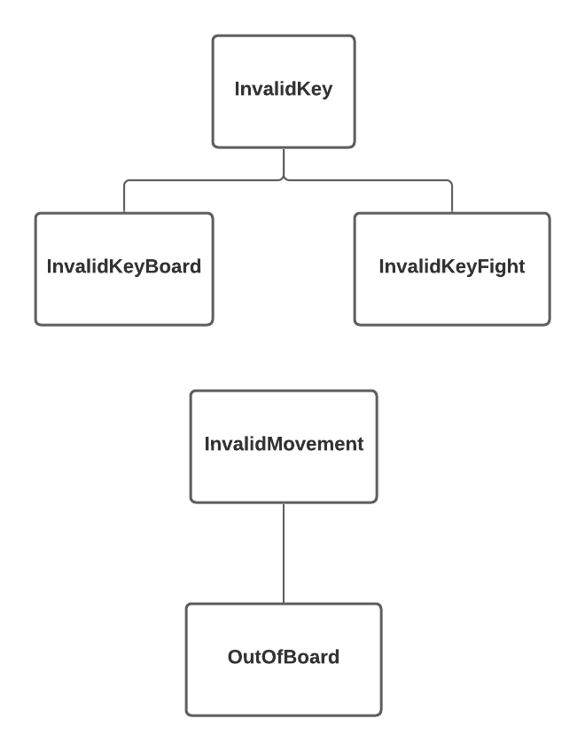

## Descrição das classes de exceção

Classe | Descrição
----- | -----
InvalidKey | Engloba todas as exceções de ações feitas com teclas inválidas.
InvalidKeyBoard | Indica a ação feita com uma tecla inválida é inútil na fase de tabuleiro.
InvalidKeyFight | Indica a ação feita com uma tecla inválida é inútil na fase de batalha com vilão.
InvalidMovement | Engloba as exceções de movimentos não aceitos no tabuleiro.
OutOfBoard | Indica que o movimento para fora do tabuleiro é inútil.